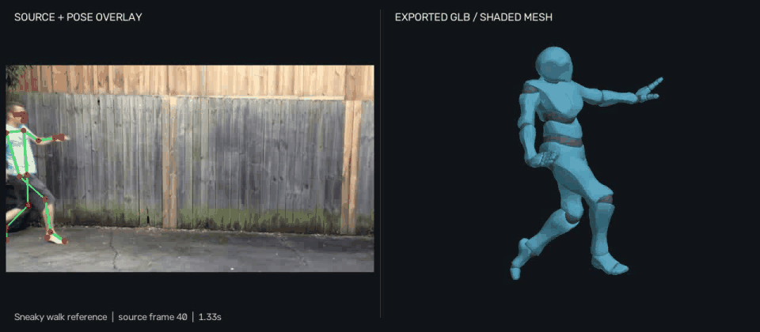
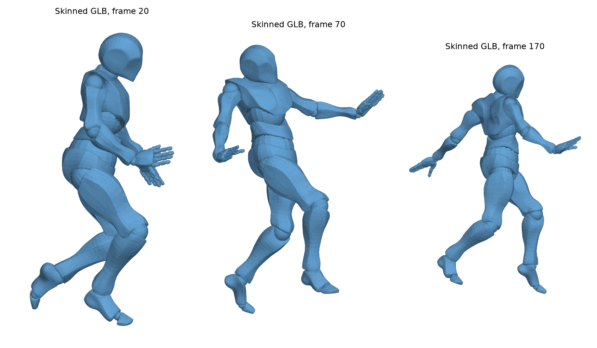
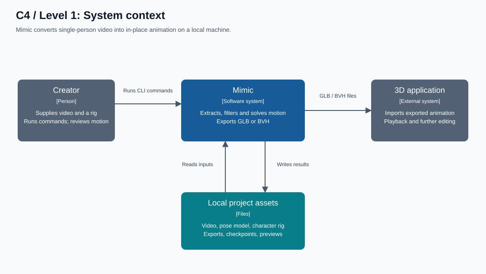
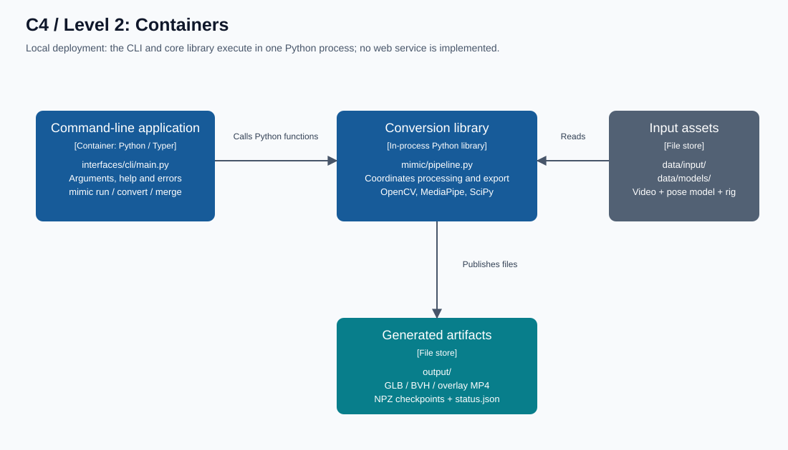
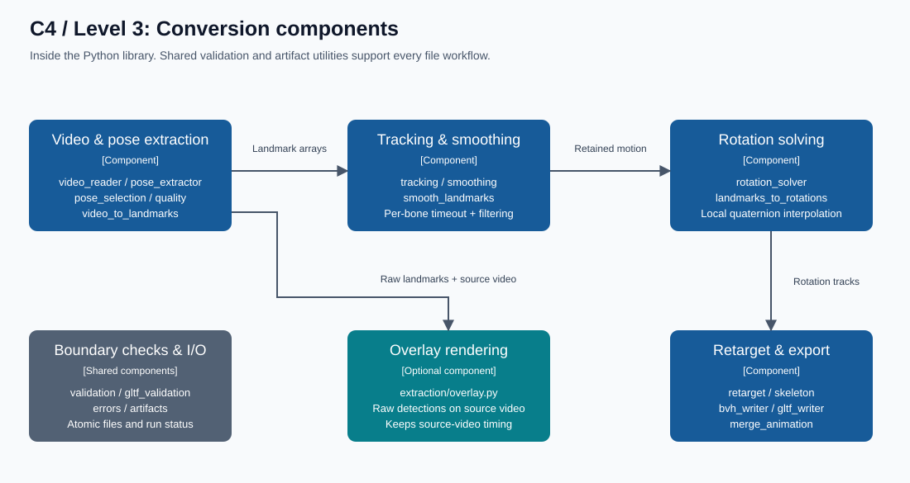

<div align="center">

<h1>Mimic</h1>
<p><strong>Turn a video into a 3D animation.</strong></p>
<p>Single-person motion capture &middot; Animated GLB &middot; Skeleton BVH &middot; Local Python pipeline</p>

<p>
  <a href="#demo">Demo</a> &nbsp; / &nbsp;
  <a href="#quick-start">Quick start</a> &nbsp; / &nbsp;
  <a href="#usage">Usage</a> &nbsp; / &nbsp;
  <a href="#architecture">Architecture</a> &nbsp; / &nbsp;
  <a href="#reference">Reference</a>
</p>

<a href="examples/animations/Sneaky%20walk%20reference_comparison.mp4">
  
</a>

<p><a href="examples/animations/Sneaky%20walk%20reference_comparison.mp4">Watch / download the video</a></p>

</div>

Mimic takes footage of one person, reconstructs body motion, and exports an
in-place animation for a rigged character or skeleton. One command handles
extraction, filtering, rotation solving, export, and an optional overlay video.

| Capture | Reconstruct | Export |
| :--- | :--- | :--- |
| Detect body landmarks and track one person | Smooth motion and interpolate short tracking gaps | Animate a character in GLB or export a BVH skeleton |

## Demo

**From video to animation.** The GIF above shows Sneaky Walk's pose overlay
on the left and its exported character animation on the right, synchronized
to the source footage.

**From rotations to a character.** These three poses are rendered from an earlier
Sneaky Walk GLB using the character's skin weights:

<p align="center">
  
</p>

<sub>The GIF and character still are recorded examples, not a live preview.</sub>

### Try the examples

**Overlay and exported animation, side by side:**

| Dance | Sneaky walk |
| --- | --- |
| [](examples/animations/Dance%20Reference_comparison.mp4) | [](examples/animations/Sneaky%20walk%20reference_comparison.mp4) |

Click a preview to open the comparison video. The right panel renders the actual
GLB skin and animation with neutral shading. Comparisons cover only the retained
animation frames, aligned to the source video (Sneaky Walk starts at frame 40).

Download a character GLB to view the exported animation, or watch its overlay
to inspect the detected pose on the original footage.

| Example | Source video | Pose overlay | Animated character |
| --- | --- | --- | --- |
| Dance | [MP4](examples/sample_videos/Dance%20Reference.mp4) | [MP4](examples/animations/Dance%20Reference_overlay.mp4) | [GLB](examples/animations/Dance%20Reference.glb) |
| Sneaky walk | [MP4](examples/sample_videos/Sneaky%20walk%20reference.mp4) | [MP4](examples/animations/Sneaky%20walk%20reference_overlay.mp4) | [GLB](examples/animations/Sneaky%20walk%20reference.glb) |

Regenerate both examples from the project root:

```cmd
mimic run "examples/sample_videos/Dance Reference.mp4" --format glb --overlay --max-missing-frames 20 -o "examples/animations/Dance Reference.glb"
mimic run "examples/sample_videos/Sneaky walk reference.mp4" --format glb --overlay --max-missing-frames 20 -o "examples/animations/Sneaky walk reference.glb"
```

Overlays cover the source footage. GLB animations can end earlier when a bone
exceeds the 20-frame missing-observation limit.

## Quick start

Create a virtual environment from the project root and install the project.
Python 3.11 is the environment used for development; package metadata permits
Python 3.9 and later.

```cmd
py -3.11 -m venv .venv
.venv\Scripts\python.exe -m pip install -e ".[dev]"
```

Activate it in **Command Prompt**:

```cmd
.venv\Scripts\activate.bat
```

<details>
<summary>Using PowerShell?</summary>

Or in **PowerShell**:

```powershell
.\.venv\Scripts\Activate.ps1
```

</details>

Required assets:

- `data/models/pose_landmarker.task`: MediaPipe Pose Landmarker model.
- `data/models/model.glb`: rigged Mixamo-compatible character for GLB output.
  Use `--model` for another character. BVH does not require a character model.
- Place source videos in `data/input/`, or supply another video path.

The model files are not downloaded automatically. If the pose model is missing,
extraction reports its expected path and a download URL.

## Usage

```cmd
mimic run "data/input/Dance Reference.mp4" --format glb --overlay --max-missing-frames 20
mimic run "data/input/Dance Reference.mp4" --format bvh --overlay --max-missing-frames 20
```

`run` extracts once, smooths landmarks, solves rotations, and exports. For GLB,
it also applies the animation to the character model.

| Option | Default | Behavior |
| --- | --- | --- |
| `--format`, `-f` | `glb` | `glb` for an animated character; `bvh` for a skeleton |
| `--overlay` | Off | Save a landmark overlay MP4 beside the animation |
| `--max-missing-frames` | `20` | Per-bone allowance for consecutive unseen source frames |
| `--model` | `data/models/model.glb` | Character GLB; only accepted with GLB output |
| `--fps` | Source rate | Resample animation rotations; overlay keeps source rate |
| `--output`, `-o` | Under `output/` | Final animation path; extension must match the format |

Omit `--overlay` to skip video generation. Use `mimic run --help` for help.

## Architecture

Mimic runs locally in one Python process. The C4 views below move from the
system's users and files to its runtime layout and conversion components.

### 1. System context

<p align="center">
  
</p>

<details>
<summary><strong>2 &middot; Containers &middot; CLI, library, and file stores</strong></summary>

The command-line application calls the conversion library in the same Python
process. The library is not a separately deployed service.



</details>

<details>
<summary><strong>3 &middot; Components &middot; inside the conversion pipeline</strong></summary>

Extraction feeds tracking and smoothing, then rotation solving and export.
Shared validation and artifact utilities support the pipeline; overlay rendering
is optional.



</details>

[Explore the module structure](docs/STRUCTURE.md) &middot; [Read the animation conventions](docs/ANIMATION_PIPELINE.md)

## Reference

Command examples, output locations, and troubleshooting are collected below.

<details>
<summary><strong>Output files and checkpoints</strong></summary>

Defaults for the examples above:

| Format | Animation | Optional overlay |
| --- | --- | --- |
| GLB | `output/Dance Reference_animated.glb` | `output/Dance Reference_animated_overlay.mp4` |
| BVH | `output/Dance Reference.bvh` | `output/Dance Reference_overlay.mp4` |

`output/` is relative to the project root, not the source video's directory.
An explicit `-o` overrides the animation location; the overlay follows that
location and filename stem with `_overlay.mp4` appended.

Checkpoints are retained in `output/intermediate/<video stem>/`:

- `landmarks.npz`: raw detections and the source-frame offset.
- `landmarks_smooth.npz`: filtered landmarks, possibly shortened by a timer.
- `rotations.npz`: bone rotations, frame counts, and timeout metadata.
- `skeleton.glb`: intermediate skeleton when merging a character in `run`.
- `status.json`: run state, failing stage/error or completed output paths.

The overlay shows the **full source video and raw detections**. It may continue
after a tracking timeout ends the exported animation. Runs with the same video
stem share the checkpoint directory; use distinct stems to keep runs separate.

</details>

<details>
<summary><strong>Missing-frame timers</strong></summary>

Each bone has its own timer. A reliable observation resets it. With the default
of 20, up to 20 consecutive missing source frames are allowed; the 21st is
excluded and ends **all** animation tracks. This is a successful shortened export,
not a processing error. The console and `rotations.npz` identify the expired bones.

Short internal gaps use quaternion interpolation. At a clip boundary, there is
no observation on both sides, so the nearest observed rotation is held within
the budget. A bone never observed in the retained segment uses its rest rotation
until its timer expires. Increasing the budget permits longer estimates; it does
not restore missing measurements.

For individual overrides, edit `BONE_MISSING_FRAME_LIMITS` in `mimic/config.py`:

```python
BONE_MISSING_FRAME_LIMITS = {"left_hand": 30, "right_hand": 30}
```

Names come from `BONE_ORDER` in `mimic/processing/rotation_solver.py`. Overrides
win over the CLI default. Timers count source frames before `--fps` resampling.

</details>

<details>
<summary><strong>Individual commands</strong></summary>

| Command | Purpose | Example |
| --- | --- | --- |
| `extract` | Save landmarks; optionally create 3D plots | `mimic extract video.mp4 --visualize` |
| `smooth` | Filter and apply timer limits to a landmark file | `mimic smooth output/video.npz` |
| `convert` | Export a skeleton only: GLB, glTF, or BVH | `mimic convert video.mp4 --format bvh` |
| `visualize` | Overlay existing landmarks on a video | `mimic visualize video.mp4` |
| `merge` | Apply skeleton GLB animation to a character | `mimic merge data/models/model.glb output/video.glb` |
| `info` | Print package version | `mimic info` |

`extract --visualize` saves plots in `output/previews/<video>/`; it does not
create an overlay MP4. `visualize` reads `output/<video>.npz` from `extract` by
default. After `run` or `convert`, point it at the checkpoint explicitly:

```cmd
mimic visualize "data/input/Dance Reference.mp4" --npz "output/intermediate/Dance Reference/landmarks.npz"
```

`convert` does not merge a character; use `run` for a complete GLB.
`--max-missing-frames` is available on `run` and `convert`. Standalone `smooth`
uses the configuration defaults. All commands support `-h` and `--help`.

</details>

<details>
<summary><strong>Input checks and troubleshooting</strong></summary>

Default video limits in `mimic/config.py`:

| Check | Limit |
| --- | --- |
| File size | 250 MiB |
| Duration | 120 seconds |
| Resolution | 8,294,400 pixels; neither dimension above 3,840 |
| Source frame rate | Positive and at most 120 fps |
| Source frame count | At most 14,400 |
| Decoded frames held in memory | 1 GiB |

Compressed file size can be small while decoded memory is large. Trim or
downscale videos that exceed the budget. Empty, unreadable, truncated, or
inconsistent videos are rejected rather than exported as partial successes.

| Result | What to do |
| --- | --- |
| `no_human_pose` / `poor_pose_quality` | Use clearer, well-lit footage with a visible human body. Animals are unsupported; this is not a species classifier. |
| `multiple_people` | Crop or choose single-person footage. Duplicate proposals are merged; a distinct second pose must persist for 0.3 seconds, at least 3 frames. This remains a heuristic. |
| Tracking timeout | Check the reported bone and source frame in the overlay; choose a better clip or adjust its timer. |
| Missing landmark NPZ | Run `extract` first or use `visualize --npz` with a conversion checkpoint. |
| Invalid hierarchy, quaternions, timeline, or skin | Regenerate intermediate files or use a compatible rigged model. |
| Unexpected traceback | Capture the complete log and check which Python environment is running. |

Expected failures print `Error: <stage>: [code] <message>` where stage/code are
available, and exit nonzero. Unexpected failures print a plain traceback.
Files are published atomically, so a failed replacement preserves the previous
file. A later failure can leave completed outputs from earlier stages; check
`status.json` rather than assuming an existing file means the latest run succeeded.

Capture logs in **Command Prompt** (create `output/` first if it does not exist):

```cmd
mimic run "data/input/Dance Reference.mp4" --overlay > output\Dance_run.log 2>&1
```

If `mimic` resolves to a different Python installation, use the project interpreter:

```cmd
.venv\Scripts\python.exe -m interfaces.cli.main run "data/input/Dance Reference.mp4" --overlay
```

</details>

## Current limits

Motion is in place: root travel and foot locking are not reconstructed. Fingers
stay in the character's rest pose; limb twist and spine motion are approximations.
FBX export and the web/API interface are not implemented.

## Development and documentation

```cmd
.venv\Scripts\python.exe -m pytest -q
```

- [Project scope and supported behavior](docs/PROJECT.md)
- [Module structure](docs/STRUCTURE.md)
- [Animation conventions and data flow](docs/ANIMATION_PIPELINE.md)

---

<p align="center">Mimic &middot; <a href="LICENSE">MIT License</a></p>
